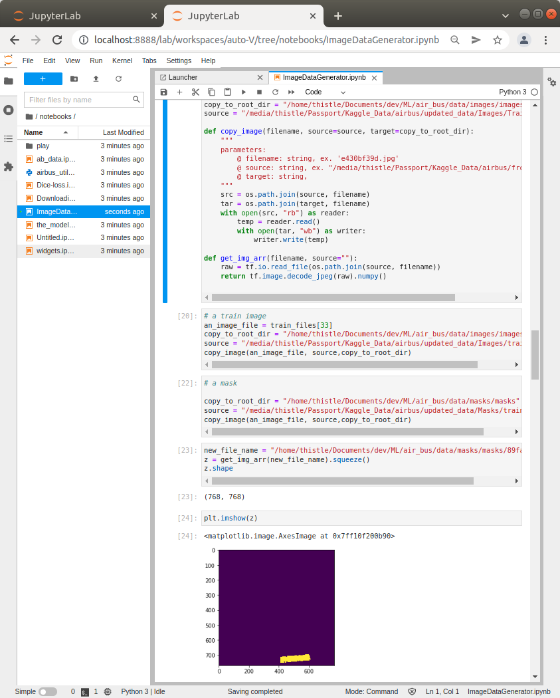

<h1>air_bus</h1>

<h3>this is kaggle challenge</h3>

see <a href="https://www.kaggle.com/c/airbus-ship-detection">airbus</a> to get more details on the specifics of the competition.

<h3>The key here was using the dice loss function</h3>

This project has been set up using PyScaffold 3.2.2. For details and usage
information on PyScaffold see https://pyscaffold.org/.
